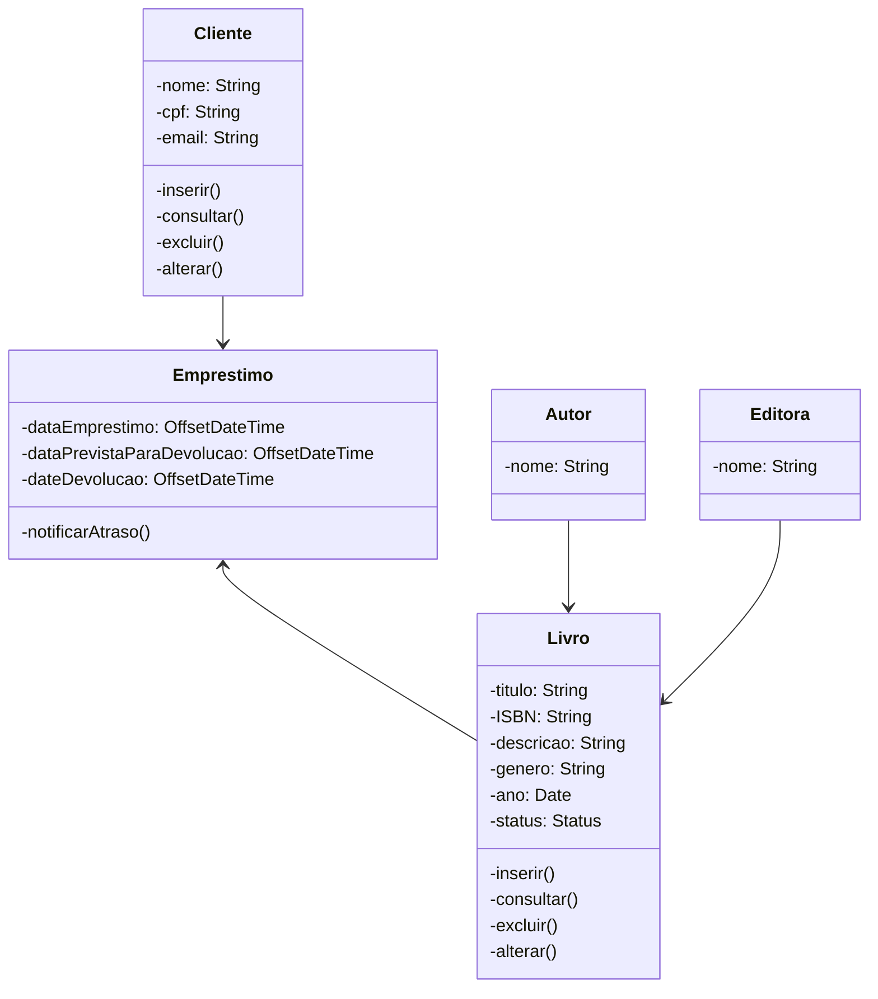

# Projeto de Livraria

Este é um projeto simples para uma livraria, com o objetivo de gerenciar empréstimos de livros, clientes, autores e editoras. O projeto utiliza classes como `Emprestimo`, `Cliente`, `Livro`, `Autor` e `Editora` para representar as entidades relacionadas à livraria.

## Diagrama de Classes

A seguir, apresentamos o diagrama de classes atualizado do projeto:

## Funcionalidades

O projeto de livraria possui as seguintes funcionalidades:

- **Livro**: A classe `Livro` representa um livro registrado na livraria, com informações como título, ISBN, descrição, gênero, ano de publicação e status(EMPRESTADO, DISPONIVEL). Possui métodos para inserir, consultar, excluir e alterar informações do livro.

- **Cliente**: A classe `Cliente` representa um cliente da livraria, contendo informações como nome, CPF e email. Possui métodos para inserir, consultar, excluir e alterar informações do cliente.

- **Emprestimo**: A classe `Emprestimo` representa o empréstimo de um livro, contendo informações sobre a data de empréstimo, a data prevista para devolução e a data de devolução efetiva. Além disso, possui um método para notificar atraso.

- **Autor**: A classe `Autor` representa um autor de livros, contendo informações como nome. É associada aos livros por meio de uma relação. Podendo ter uma ou mais autores.

- **Editora**: A classe `Editora` representa uma editora de livros, contendo informações como nome. É associada aos livros por meio de uma relação. Podendo ter uma ou mais editoras.

As funcionalidades mencionadas permitem que a livraria gerencie empréstimos de livros, cadastre e gerencie clientes, controle informações sobre os livros disponíveis, bem como associe autores e editoras aos livros.

> **Observação**: Este projeto está em desenvolvimento. Ao finalizar o projeto, serão apresentados os endpoints disponíveis para interação com a API. Atualizações serão feitas neste README para fornecer as informações necessárias sobre como utilizar e interagir com a aplicação. Fique atento para futuras atualizações!

