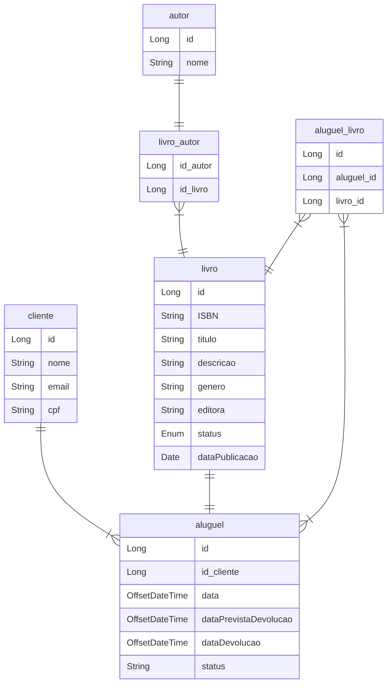

# Projeto de Livraria

Este é um projeto simples para uma livraria, com o objetivo de gerenciar empréstimos de livros para clientes. O projeto utiliza classes como `Aluguel`, `Cliente`, `Livro`, `Autor` para representar as entidades relacionadas à livraria.

## Modelo Entidade Relacionamento 

> **Observação**: É importante destacar que o MER (Modelo Entidade-Relacionamento) está em constante evolução, uma vez que estou aprendendo a utilizar a ferramenta mermaid para representá-lo. Neste estágio inicial, o MER pode não refletir com total fidelidade o que está sendo desenvolvido e está sujeito a modificações e ajustes futuros.

A seguir, o MER atualizado do projeto:

## Funcionalidades

O projeto de livraria possui as seguintes funcionalidades:

- **Livro**: A Entidade `Livro` representa um livro registrado na livraria, com informações como título, ISBN, descrição, gênero, ano de publicação e status(EMPRESTADO, DISPONIVEL). Possui métodos para inserir, consultar, excluir e alterar informações do livro.

- **Cliente**: A Entidade `Cliente` representa um cliente da livraria, contendo informações como nome, CPF e email. Possui métodos para inserir, consultar, excluir e alterar informações do cliente.

- **Emprestimo**: A Entidade `Emprestimo` representa o empréstimo de um livro, contendo informações sobre a data de empréstimo, a data prevista para devolução e a data de devolução efetiva. Além disso, possui um método para notificar atraso.

- **Autor**: A Entidade `Autor` representa um autor de livros, contendo informações como nome. É associada aos livros por meio de uma relação. Podendo ter uma ou mais autores.
 

As funcionalidades mencionadas permitem que a livraria gerencie empréstimos de livros, cadastre e gerencie clientes, controle informações sobre os livros disponíveis, bem como associe autores e editoras aos livros.

> **Observação**: Este projeto está em desenvolvimento. Ao finalizar o projeto, serão apresentados os endpoints disponíveis para interação com a API. Atualizações serão feitas neste README para fornecer as informações necessárias sobre como utilizar e interagir com a aplicação. Fique atento para futuras atualizações!

## Tecnologias Utilizadas
- **Java 17**: Linguagem de programação utilizada para desenvolver a API.
- **Spring Boot 3.1.0**: Framework para criação de aplicações web robustas e escaláveis.
- **MySQL**: Sistema de gerenciamento de banco de dados relacional.

## Dependências
- **Spring Web**: Biblioteca que facilita a criação de aplicativos da web com o Spring.
- **Devtools**: Fornece ferramentas de desenvolvimento como hot-reloading para facilitar o ciclo de desenvolvimento.
- **Lombok**: Biblioteca que simplifica a criação de classes Java, reduzindo a quantidade de código boilerplate.
- **Flyway**: Gerenciador de migração de banco de dados que permite evoluir a estrutura do banco de dados de forma controlada.
- **Validation**: Biblioteca utilizada para validar os dados recebidos pela API, garantindo a integridade e consistência dos dados.

## Metodologias e padrões

Neste projeto, foram utilizadas diversas metodologias e padrões de projeto para garantir a qualidade e a manutenibilidade do código. Algumas delas incluem:

#### Domain-Driven Design (DDD)

O DDD é uma abordagem de desenvolvimento de software que visa modelar o domínio do negócio em termos de entidades, agregados, serviços e valorizar a linguagem e o conhecimento do domínio. A implementação do DDD pode facilitar a comunicação entre desenvolvedores e especialistas do domínio, resultando em um código mais claro e coeso.

#### SOLID

SOLID é um acrônimo que representa cinco princípios de design de software: Single Responsibility Principle, Open/Closed Principle, Liskov Substitution Principle, Interface Segregation Principle e Dependency Inversion Principle. A aplicação desses princípios ajuda a criar um código mais modular, flexível e fácil de manter.

#### Problem Details (RFC 7807)

A RFC 7807 é uma especificação que define um formato comum para a representação de problemas em APIs RESTful. Para tratar exceções e erros de forma padronizada, foi implementado o padrão Problem Details em nossas respostas de erro, fornecendo informações detalhadas sobre o problema ocorrido.

#### Outras Práticas

Além disso, adotei outras práticas de desenvolvimento, como testes unitários, refatoração e code review, para garantir a qualidade e a robustez do código.

## Executando o Projeto
1. Clone este repositório em sua máquina local.
2. Certifique-se de ter o Java 17 instalado e configurado em seu ambiente.
3. Configure o banco de dados MySQL e atualize as configurações de conexão no arquivo `application.properties`.
4. Execute o comando `./mvnw spring-boot:run` no terminal para iniciar a aplicação.
5. Acesse a API em `http://localhost:8080` para começar a utilizar os serviços disponíveis.

## Documentação da API
A documentação da API está disponível em [link-futuro-da-documentação]. Lá você encontrará detalhes sobre os endpoints disponíveis e como utilizá-los.